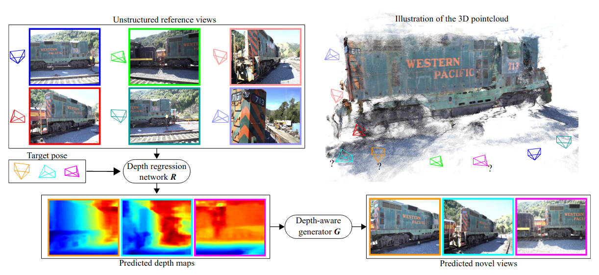

# RGBD-Net

## [IEEE Paper](https://ieeexplore.ieee.org/document/9665841) |  [arXiv](https://arxiv.org/abs/2011.14398)
<div style="text-align: justify"> This repository contains a pytorch lightning implementation for the 3DV 2021 RGBD-Net paper. We propose a new cascaded architecture for novel view synthesis, called RGBD-Net, which consists of two core components: a hierarchical depth regression network and a depth-aware generator network. The former one predicts depth maps of the target views by using adaptive depth scaling, while the latter one leverages the predicted depths and renders spatially and temporally consistent target images.</div><br><br>



## Installation

#### Tested on Ubuntu 16.04 + Pytorch 1.8 + Pytorch Lignting 1.3.5

Install environment:
```
pip install pytorch-lightning, inplace_abn
pip install imageio, pillow, scikit-image, opencv-python, config-argparse, lpips
```

### DTU dataset

#### Data download

Download the preprocessed [DTU training data](https://drive.google.com/file/d/1eDjh-_bxKKnEuz5h-HXS7EDJn59clx6V/view)
and [Depth_raw](https://virutalbuy-public.oss-cn-hangzhou.aliyuncs.com/share/cascade-stereo/CasMVSNet/dtu_data/dtu_train_hr/Depths_raw.zip) from original [MVSNet repo](https://github.com/YoYo000/MVSNet)
and unzip. We provide a [DTU example](https://1drv.ms/u/s!AjyDwSVHuwr8zhAAXh7x5We9czKj?e=oStQ48), please
follow with the example's folder structure.

#### Training model

With depth supervision
```
python train.py --root_dir dataset_path --num_epochs 32 \
                --batch_size 4 --depth_interval 2.65 --n_depths 8 32 48 --interval_ratios 1.0 2.0 4.0 \
                --optimizer adam --lr 1e-3 --lr_scheduler cosine --num_gpus 4 --loss_type sup --exp_name sup \
                --ckpt_dir ./ckpts --log_dir ./logs
```

Without depth supervision
```
python train.py --root_dir dataset_path --num_epochs 32 \
                --batch_size 4 --depth_interval 2.65 --n_depths 8 32 48 --interval_ratios 1.0 2.0 4.0 \
                --optimizer adam --lr 1e-3 --lr_scheduler cosine --num_gpus 4 --loss_type unsup --exp_name unsup \
                --ckpt_dir ./ckpts --log_dir ./logs
```

## Testing model
Please change the weight path in test.py to your trained model and execute python test.py
```
python test.py --root_dir dataset_path
```

## Citation
If you find our code or paper helps, please consider citing:
```
@inproceedings{nguyen2021rgbd,
  title={RGBD-Net: Predicting color and depth images for novel views synthesis},
  author={Nguyen-Ha, Phong and Karnewar, Animesh and Huynh, Lam and Rahtu, Esa and Heikkila, Janne},
  booktitle={Proceedings of the International Conference on 3D Vision},
  year={2021}
}
```

Big thanks to [**CasMVSNet_pl**](https://github.com/kwea123/CasMVSNet_pl), our code is partially
borrowing from them.


